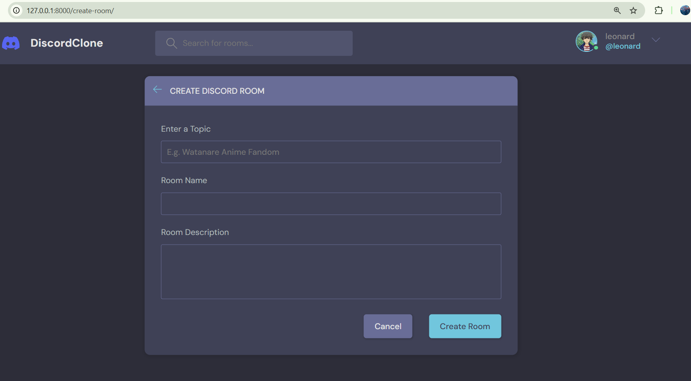

# Discord Clone (Django Web App)

A functional Discord-inspired web application built with **Django**, featuring real-time community room creation, user profile management, topic-based filtering, and more. This platform allows users to connect, chat, and collaborate in a structured environment.

## 🔗 Live GitHub Repository

[https://github.com/M-EdwardSamuel/DiscordClone](https://github.com/M-EdwardSamuel/DiscordClone)

---

## 📸 Screenshots

| Home (Before Login) | Home (After Login) |
|---------------------|--------------------|
|  |  |

| Register Page | Login Page |
|---------------|------------|
|  |  |

| User Profile | Edit Profile |
|--------------|--------------|
|  |  |

| Create Room | Room Page |
|-------------|-----------|
|  |  |

| Search Rooms | Search by Topics |
|----------------|------------------|
|  |  |

---

## 🚀 Features

- 🧑‍💼 **User Authentication**
  - Register, Login, Logout functionality
- 🧾 **Create & Manage Rooms**
  - Topic-based rooms with full CRUD functionality (Create, Read, Update, Delete)
- 🔍 **Advanced Filtering**
  - Search by topic or keywords
- 🧑‍💻 **User Profile Management**
  - Upload avatars, update bio, view hosted rooms
- 💬 **Interactive Messaging**
  - Post messages, delete own messages
- 🛠️ **Django Messages Framework**
  - Inline error messages and user feedback

---

## 🛠️ Tech Stack

- **Frontend**: HTML5, CSS3 (with provided styles)
- **Backend**: Django (Python)
- **Database**: SQLite (default), extensible to PostgreSQL
- **Tools**: Django Forms, Auth, ORM, Messages Framework

---

## 📁 Project Setup

```bash
# Clone the repo
git clone https://github.com/M-EdwardSamuel/DiscordClone.git

# Navigate to project directory
cd DiscordClone

# Create and activate virtual environment
python -m venv env
source env/bin/activate    # On Windows: env\Scripts\activate

# Install dependencies
pip install -r requirements.txt

# Run the server
python manage.py runserver
```

---

## 🙋‍♂️ Author

**Edward Samuel**  
📍 GitHub: [@M-EdwardSamuel](https://github.com/M-EdwardSamuel)

---

